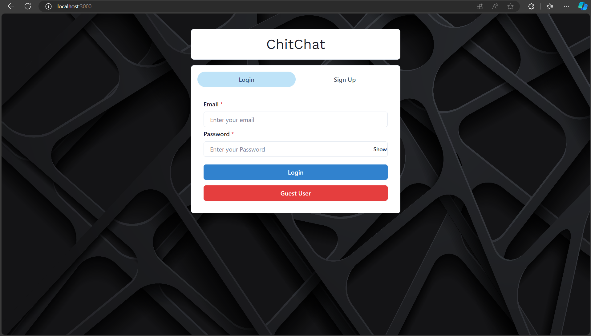

# Chatting Website

## Overview
The **Chatting Website** is a real-time chat application developed using the MERN stack (MongoDB, Express, React, Node.js) and Socket.io for instant messaging. It supports user authentication with JWT-based login and signup, one-to-one messaging, group chats, notifications, and user search functionality.

## Features

### User Authentication:
- **Sign Up:** Create a new account using username, email, and password.
- **Login:** Access existing accounts with secure authentication.
- **JWT Authentication:** Secure access using JSON Web Tokens.

### Chat Functionality:
- **Search Users:** Search for users to start a conversation.
- **One-to-One Chat:** Real-time private messaging between two users.
- **Group Chat:** 
  - Create and join group chats.
  - Update group details like name and participants.
  - Group messaging in real-time.
- **Notifications:** Real-time notifications for new messages.
- **User Presence:** Display online/offline status of users.
- **User Information:** View user profiles with details like username and email.

## Tech Stack

**Frontend:**  
  - React (JavaScript, HTML, CSS)
  - Axios (for API requests)
  - Socket.io-client (for real-time communication)

**Backend:**  
  - Node.js, Express (for server-side logic)
  - MongoDB (for database)
  - Mongoose (for MongoDB object modeling)
  - Socket.io (for real-time messaging)
  - JWT (for authentication)
  - Bcrypt (for password hashing)

**Database:**  
  - MongoDB Atlas (Cloud database)

## Getting Started

### Prerequisites
- **Node.js**: Ensure Node.js is installed on your system.
- **MongoDB**: Set up MongoDB locally or use MongoDB Atlas for a cloud database.

## Screenshots

### Authentication Screens
<div style="display: flex; flex-wrap: wrap; gap: 20px;">
  
  
  
</div>

### Chat Features
<div style="display: flex; flex-wrap: wrap; gap: 20px;">
  
  
  
</div>

### Group Chat Management
<div style="display: flex; flex-wrap: wrap; gap: 20px;">
  
  
</div>

### Notifications & Search
<div style="display: flex; flex-wrap: wrap; gap: 20px;">
  
  
</div>


### Clone the Repository

\`\`\`bash
git clone https://github.com/swarnps3/ChitChat
cd chatting-website
\`\`\`

### Backend Setup

1. **Navigate to the server folder**:
    \`\`\`bash
    cd server
    \`\`\`

2. **Install dependencies**:
    \`\`\`bash
    npm install
    \`\`\`

3. **Set up environment variables**: Create a \`.env\` file in the \`server\` folder with the following variables:
    \`\`\`env
    MONGO_URI=your_mongodb_connection_string
    JWT_SECRET=your_jwt_secret
    SOCKET_PORT=5000
    \`\`\`

4. **Start the server**:
    \`\`\`bash
    npm run server
    \`\`\`

### Frontend Setup

1. **Navigate to the client folder**:
    \`\`\`bash
    cd client
    \`\`\`

2. **Install dependencies**:
    \`\`\`bash
    npm install
    \`\`\`

3. **Run the React application**:
    \`\`\`bash
    npm start
    \`\`\`

4. **Access the website**:
    ```
    http://localhost:3000
    ```

## API Endpoints

### Authentication
- **POST /api/user/**
  - Request Body:
    \`\`\`json
    {
      "username": "user-name",
      "email": "user@example.com",
      "password": "your-password"
    }
    \`\`\`
  - Response:
    \`\`\`json
    {
      "message": "User registered successfully"
    }
    \`\`\`

- **POST /api/user/login**
  - Request Body:
    \`\`\`json
    {
      "email": "user@example.com",
      "password": "your-password"
    }
    \`\`\`
  - Response:
    \`\`\`json
    {
      "token": "jwt-token",
      "user": {
        "id": "user-id",
        "username": "user-name",
        "email": "user-email"
      }
    }
    \`\`\`

### Users
- **GET /api/users/search?query=username**
  - Fetch users based on search query.

### Chats
- **POST /api/chats**
  - Create a one-on-one chat.
  
- **POST /api/chats/group**
  - Create a new group chat.

- **PUT /api/chats/group/:chatId**
  - Update group chat details.

### Messages
- **GET /api/messages/:chatId**
  - Fetch all messages for a given chat.
  
- **POST /api/messages**
  - Send a new message in a chat.
  - Request Body:
    \`\`\`json
    {
      "chatId": "chat-id",
      "content": "message content"
    }
    \`\`\`

## Folder Structure

```
chatting-website/
├── Backend/
│   ├── config/
│   │   ├── db.js
│   │   ├── generateToken.js
│   ├── controllers/
│   │   ├── chatControllers.js
│   │   ├── messageControllers.js
│   │   ├── userControllers.js
│   ├── dummy/
│   │   └── data.js
│   ├── middleware/
│   │   ├── authMiddleware.js
│   │   ├── errorMiddleware.js
│   ├── models/
│   │   ├── chatModel.js
│   │   ├── messageModel.js
│   │   ├── userModel.js
│   ├── routes/
│   │   ├── chatRoutes.js
│   │   ├── messageRoutes.js
│   │   ├── userRoutes.js
│   ├── server.js
│   ├── .env
│   ├── package.json
│   ├── package-lock.json
│
├── frontend/
│   ├── public/
│   │   ├── favicon.ico
│   │   ├── index.html
│   │   ├── logo192.png
│   │   ├── logo512.png
│   │   ├── manifest.json
│   │   ├── robots.txt
│   ├── src/
│   │   ├── Context/
│   │   │   └── ChatProvider.js
│   │   ├── animations/
│   │   │   └── typing.json
│   │   ├── components/
│   │   │   ├── Authentication/
│   │   │   │   ├── Login.js
│   │   │   │   └── Signup.js
│   │   │   ├── miscellaneous/
│   │   │   │   ├── GroupChatModal.js
│   │   │   │   ├── ProfileModal.js
│   │   │   │   ├── SideDrawer.js
│   │   │   │   ├── UpdateGroupChatModal.js
│   │   │   │   └── userAvatar/
│   │   │   ├── ChatLoading.js
│   │   │   ├── Chatbox.js
│   │   │   ├── MyChats.js
│   │   │   ├── ScrollableChat.js
│   │   │   ├── SingleChat.js
│   │   │   └── styles.css
│   │   ├── config/
│   │   │   └── ChatLogics.js
│   │   ├── pages/
│   │   │   ├── ChatPage.js
│   │   │   └── Homepage.js
│   │   ├── App.css
│   │   ├── App.js
│   │   ├── background.png
│   │   ├── index.css
│   │   └── index.js
│   ├── .gitignore
│   ├── README.md
│   ├── package.json
│   ├── package-lock.json
│
├── node_modules/
├── README.md
└── trial.txt
```

## Contributing

1. Fork the repository.
2. Clone your fork.
3. Create a new branch:
    \`\`\`bash
    git checkout -b feature/your-feature
    \`\`\`
4. Commit your changes:
    \`\`\`bash
    git commit -m "Add feature"
    \`\`\`
5. Push to your fork:
    \`\`\`bash
    git push origin feature/your-feature
    \`\`\`
6. Create a pull request.

## Contact
**Author**: [Swarn](https://github.com/swarnps3)


